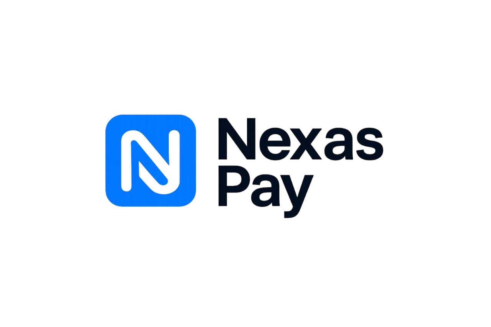
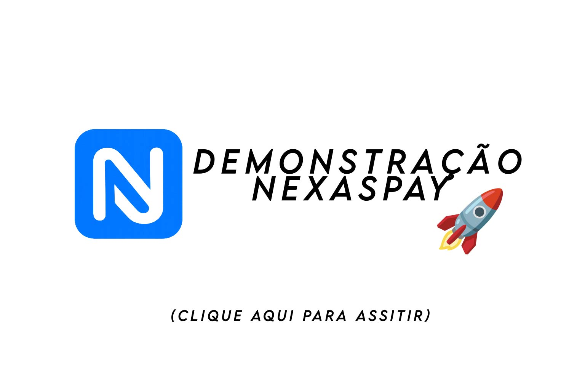
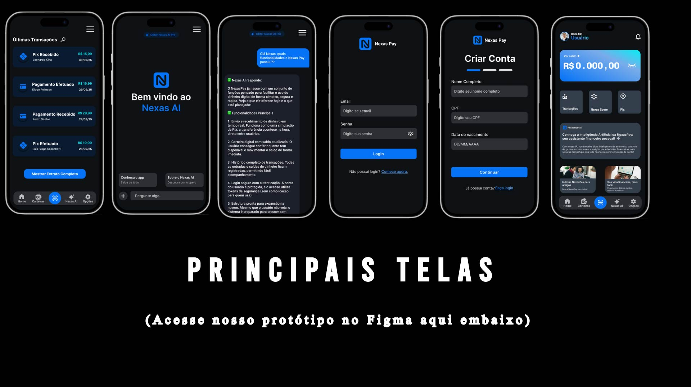
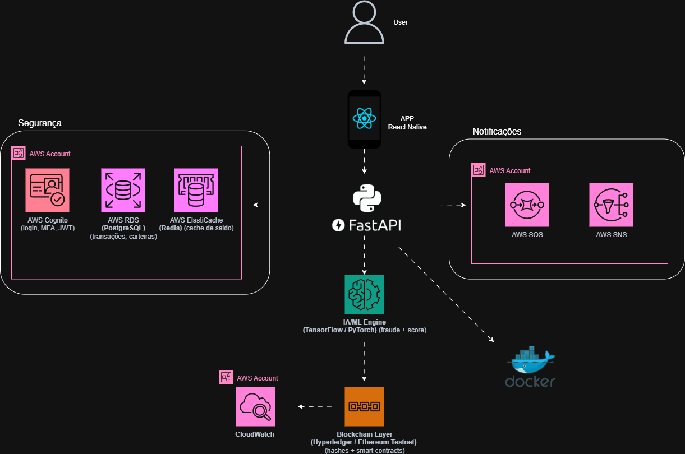

  

 

  
  
  
  

## 🎥 Vídeo de Apresentação

> [!IMPORTANT]
> Este repositório é o **hub central** da **NexasPay**, reunindo os projetos que compõem nosso ecossistema financeiro digital.

# 💳 NexasPay

A **NexasPay** é uma plataforma de **pagamentos digitais inteligente, segura e escalável**, criada para oferecer **experiência simplificada** tanto para usuários quanto para negócios.  
Com foco em **inovação e tecnologia**, a solução combina **app mobile, API robusta e infraestrutura em nuvem**.

[➡️ Clique aqui para acessar o protótipo no Figma](https://www.figma.com/proto/5DCAR8BqB7s7Jp6hkWmdLi/NexasPay---App?node-id=0-1&p=f&t=FKQu3fCfLblTXu8D-0)

---

## 🚀 Entrega do MVP

A equipe **NexasPay** concluiu e entregou o **MVP funcional** (Produto Mínimo Viável) do ecossistema, composto por:

- Aplicativo Mobile em **React Native + Expo**  
- Backend em **FastAPI (Python)**  
- Banco de dados relacional **PostgreSQL**  
- Containerização com **Docker**

> ⚠️ Por questões de **prazo e escopo**, os módulos de **Machine Learning (IA/antifraude)**, **integrações AWS (Cognito, ECS, SQS/SNS)** e **Blockchain (hashes e smart contracts)** **não foram incluídos nesta versão** do MVP.  
> Eles estão planejados para as **fases seguintes de evolução do produto**, conforme o roadmap técnico do projeto.

---

## 🌍 Projetos

A NexasPay é formada por diferentes repositórios dentro desta organização:

| **Projeto** | **Descrição** | **Repositório** |
|-------------|---------------|-----------------|
| 📱 **App NexasPay** | Aplicativo mobile desenvolvido em **React Native**, interface simples e intuitiva para transferências, pagamentos e gerenciamento de carteira digital. | [nexaspay-app](https://github.com/NexasPay/app-nexaspay) |
| ⚡ **API NexasPay** | Backend em **Python + FastAPI**, com suporte a **AWS**, **Docker** e banco relacional, garantindo performance, segurança e escalabilidade. | [nexaspay-api](https://github.com/NexasPay/api-nexaspay) |

---

## 🏗️ Arquitetura do Sistema

Abaixo está o diagrama da arquitetura da **Carteira Digital Inteligente**.  
O fluxo mostra como o **usuário** acessa o **app React Native**, que se conecta ao **backend FastAPI**.  
Esse backend integra autenticação (**AWS Cognito**), banco de dados (**RDS**), cache (**ElastiCache**), mensageria (**SQS/SNS**), além de módulos de **IA/ML** (fraude + score), **Blockchain** (hashes e smart contracts) e **monitoramento com CloudWatch**, tudo empacotado em **Docker** para fácil deploy na AWS.  

---

## 🏦 Modelo do Banco de Dados

A estrutura do banco de dados foi projetada para ser relacional e escalável, suportando as principais entidades do nosso sistema de carteira digital. O diagrama abaixo representa as tabelas e seus relacionamentos.

---

## 🔧 Funcionalidades do MVP

- Envio e recebimento de dinheiro em tempo real (simulação estilo Pix).  
- Carteira digital com **saldo atualizado** e **histórico de transações**.  
- API com autenticação JWT.  
- Containers Docker para fácil deploy.  
- Estrutura escalável pronta para integração futura com **AWS** e **serviços de IA/Blockchain**.  
- **NexasScore:** indicador de confiança que mostra se o destinatário é confiável antes da transação.

---

## 💻 Tecnologias Utilizadas

- **Frontend (App)**: React Native + Expo  
- **Backend (API)**: Python + FastAPI  
- **Banco de Dados**: PostgreSQL (AWS RDS)  
- **Infraestrutura**: Docker  
- **Autenticação (Planejada)**: AWS Cognito  
- **Mensageria (Planejada)**: AWS SQS/SNS  
- **Machine Learning (Planejado)**: Modelos de score e antifraude  
- **Blockchain (Planejado)**: Registro de transações e contratos inteligentes  

---

## 📈 Roadmap Técnico

| Fase | Foco | Tecnologias |
|------|------|-------------|
| **1. MVP** | App + API + DB + Docker | React Native, FastAPI, PostgreSQL |
| **2. Cloud & Segurança** | Infra AWS, autenticação e CI/CD | Cognito, ECS, CloudWatch |
| **3. Inteligência Financeira** | Machine Learning antifraude e score | TensorFlow / Scikit-learn |
| **4. Transparência e Confiança** | Blockchain para registro de operações | Solidity / Web3 |

---

## 📜 Licença

Este projeto está licenciado sob os termos da licença [Apache 2.0](LICENSE).

---

  Feito com 💙 pela equipe <strong>NexasPay</strong> — inovação em pagamentos digitais.

